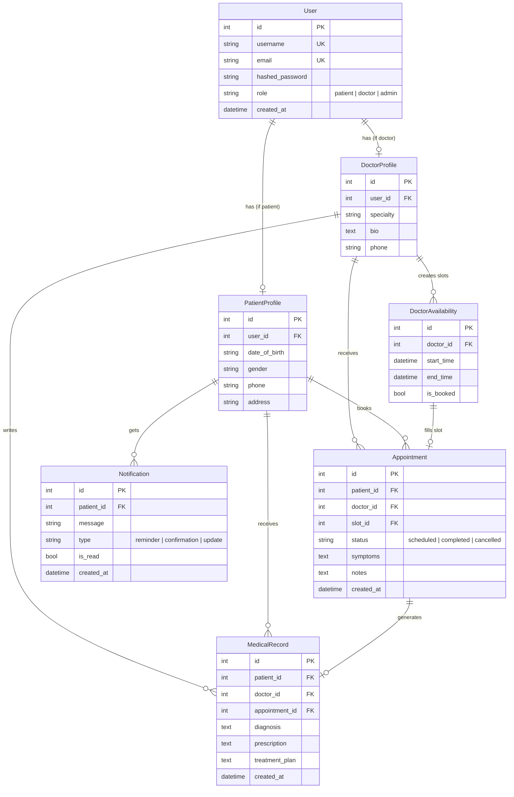

# Clinic Appointment Management System

## About the Project

A **full-stack clinic management platform** built with FastAPI and Supabase (PostgreSQL), designed for small-to-medium clinics to digitize their day-to-day operations. The system provides role-based portals for **patients**, **doctors**, and **admins** — enabling secure appointment booking, doctor scheduling, medical record management, and automated reminders through a premium glassmorphic dark-mode interface.

---

## Description

The Clinic Appointment Management System streamlines the entire patient-doctor workflow:

- **Patients** can register, browse available doctors by specialty, view open time slots, book appointments, receive automated reminders, and access their medical history.
- **Doctors** can manage their availability by creating time slots, view scheduled consultations, and create medical records (diagnosis, prescriptions, treatment plans) after appointments.
- **Admins** have full visibility across all appointments and records.

### Key Features

| Feature | Description |
|---------|-------------|
| 🔐 **JWT Authentication** | Secure login with role-based access control (patient / doctor / admin) |
| 📅 **Appointment Booking** | Patients book from doctor-defined availability slots with conflict prevention |
| 🩺 **Doctor Scheduling** | Doctors create and manage time slots with overlap detection |
| 📋 **Medical Records** | Doctors create diagnosis, prescriptions, and treatment plans per appointment |
| 🔔 **Automated Reminders** | Background tasks generate confirmation + reminder notifications |
| 📢 **Notification Center** | Real-time alerts for bookings, cancellations, and reminders |
| 🚫 **Cancellation System** | Patients/doctors can cancel appointments, freeing slots automatically |

### Tech Stack

| Layer | Technology |
|-------|-----------|
| Backend Framework | **FastAPI** (Python) |
| Database | **Supabase PostgreSQL** (cloud-hosted) |
| ORM | **SQLAlchemy 2.0** |
| Authentication | **JWT** (python-jose) + **bcrypt** password hashing |
| Validation | **Pydantic v2** |
| Frontend | Vanilla **HTML/CSS/JS** SPA (glassmorphic dark mode) |
| Deployment | Docker-ready (`Dockerfile` included) |

---

## Schema Design

### Entity-Relationship Diagram



### Table Descriptions

| Table | Purpose | Key Relationships |
|-------|---------|-------------------|
| **users** | Core identity — stores credentials and role | 1:1 with PatientProfile or DoctorProfile |
| **patient_profiles** | Patient-specific details (DOB, gender, phone, address) | Owns appointments, medical records, notifications |
| **doctor_profiles** | Doctor-specific details (specialty, bio) | Owns availability slots, appointments, medical records |
| **doctor_availabilities** | Time slots a doctor is available for booking | Linked to one appointment when booked |
| **appointments** | Booking record linking patient ↔ doctor ↔ time slot | Status lifecycle: `scheduled` → `completed` / `cancelled` |
| **medical_records** | Post-consultation records (diagnosis, prescription, treatment) | Created by doctor, linked to a specific appointment |
| **notifications** | System alerts (confirmations, reminders, updates) | Sent to patients on booking, cancellation, and via background reminders |

---

## API Endpoints

### Authentication (`/api/auth`)

| Method | Endpoint | Description | Access |
|--------|----------|-------------|--------|
| `POST` | `/register` | Register a new patient or doctor | Public |
| `POST` | `/token` | Login and receive JWT access token | Public |
| `GET` | `/me` | Get current user profile | Authenticated |

### Doctors (`/api/doctors`)

| Method | Endpoint | Description | Access |
|--------|----------|-------------|--------|
| `GET` | `/` | List all doctors | Authenticated |
| `POST` | `/availability` | Create an availability time slot | Doctor only |
| `GET` | `/availability/me` | View own availability slots | Doctor only |
| `GET` | `/{doctor_id}/availability` | View a doctor's open (future, unbooked) slots | Authenticated |

### Appointments (`/api/appointments`)

| Method | Endpoint | Description | Access |
|--------|----------|-------------|--------|
| `POST` | `/` | Book an appointment | Patient only |
| `GET` | `/` | List appointments (role-filtered) | Authenticated |
| `POST` | `/{id}/cancel` | Cancel an appointment | Patient / Doctor / Admin |
| `GET` | `/notifications` | Get patient notifications | Patient only |
| `POST` | `/notifications/{id}/read` | Mark a notification as read | Patient only |

### Medical Records (`/api/medical-records`)

| Method | Endpoint | Description | Access |
|--------|----------|-------------|--------|
| `POST` | `/` | Create a medical record for an appointment | Doctor only |
| `GET` | `/patient/{patient_id}` | Get records for a specific patient | Doctor / Admin / Own Patient |
| `GET` | `/me` | Get own medical records | Patient only |

---

## Project Structure

```
Clinic Appointment Management System/
├── app/
│   ├── main.py               # FastAPI app, CORS, router mounting
│   ├── database.py           # Supabase PostgreSQL connection + SQLAlchemy engine
│   ├── models.py             # 7 SQLAlchemy ORM models
│   ├── schemas.py            # Pydantic request/response schemas
│   ├── auth.py               # JWT creation, password hashing, role guards
│   ├── routers/
│   │   ├── auth.py           # Registration & login endpoints
│   │   ├── doctors.py        # Doctor listing & availability management
│   │   ├── appointments.py   # Booking, cancellation, notifications
│   │   └── medical_records.py # Diagnosis & prescription management
│   └── static/
│       ├── index.html        # Single-page application
│       ├── styles.css         # Glassmorphic dark-mode theme
│       └── app.js            # Frontend AJAX logic
├── .env                      # Supabase credentials (git-ignored)
├── .env.example              # Template for environment variables
├── requirements.txt          # Python dependencies
├── Dockerfile                # Container deployment config
└── README.txt                # Original project documentation
```
